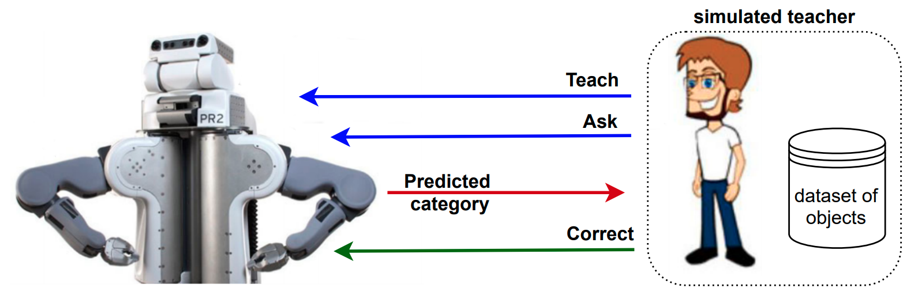
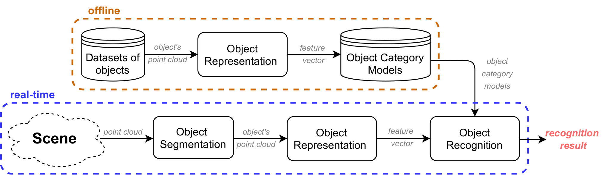

## Open-Ended Learning Approaches for 3D Object Recognition

###### [Hamidreza Kasaei](https://hkasaei.github.io/) | [cognitive robotics course](https://rugcognitiverobotics.github.io/) | [assignment description](https://github.com/SeyedHamidreza/cognitive_robotics_ws/blob/main/assignment_description.pdf)
##

<p align="center">
  
</p>
<p align="center">
  Fig.1 Abstract architecture for interaction between the simulated teacher and the learning agent
</p>

## System requirment 
- Ubuntu 18.04
- An installation script is provided for installing all necessary packages (please find it below)


## Assignment overview
Cognitive science revealed that humans learn to recognize object categories ceaselessly over time. This ability allows them to adapt to new environments,  by enhancing their knowledge from the accumulation of experiences and the conceptualization of new object categories. This ability allows them to adapt to new environments, by enhancing their knowledge from the accumulation of experiences and the conceptualization of new object categories. 

Taking this theory as an inspiration, we seek to create an interactive objectrecognition system that can learn 3D object categories in an open-ended fashion. In this project, “open-ended” implies that the set of categories to be learned is not known in advance. The training instances are extracted from on-line experiences of a robot, and thus become gradually available over time, rather than being completely available at the beginning of thelearning process. 

In this assignment, students have to optimize an open-ended learning approach for 3D object recognition and get familiar with the basic functionalities of ROS. We break this assignment down into two parts:

1. The first part is about implementing/optimizing offline 3D object recognition systems, which take an object view as input and produces the category label as output (e.g., apple, mug, fork, etc).

<p align="center">
  
</p>
<p align="center">
  Fig.2 Abstract architecture for an offline object recognition
</p>


2. The second part of this assignment is dedicated to testing your approach in an open-ended fashion.In this assignment, the number of categories is not pre-defined in advance and the knowledge of agent/robot is increasing over time by interacting with a simulated teacher using three actions: teach, ask, and correct.

<p align="center">
  
</p>
<p align="center">
  Fig.3 Abstract architecture for interaction between the simulated teacher and the learning agent
</p>

For detailed instructions, please read the [assignment description](https://github.com/SeyedHamidreza/cognitive_robotics_ws/blob/main/assignment_description.pdf).


## Installation on robotics Lab's computers

Simply clone this repository in the home/ folder:

```sh
cd ~
git clone https://github.com/SeyedHamidreza/cognitive_robotics_ws.git
```
and then, compile all packages by running the following commands:

```sh
cd ~/cognitive_robotics_ws/
catkin_make

## make *.py files executable 
roscd rug_deep_feature_extraction
chmod +x src/*.py

roscd race_perception_utils
cd bin
chmod +x *.sh

```


## Installation on your computer 

You can simply use the provided bash script to install all necessary packages on your machine. Let's see how to do that:


### Clone and Compile ROS packages

Clone the repository in your home:

```sh
sudo apt install git
cd ~
git clone https://github.com/SeyedHamidreza/cognitive_robotics_ws.git
mv cognitive_robotics_ws/*.sh ~/
```

After runnging the above commands, a folder named "cognitive_robotics_ws" and two bash files, i.e. "setup_all_required_packages.sh" and "setup_bashrc.sh", should be exist in your home folder. 
Then, run the following lines:

```bash
cd ~
bash setup_bashrc.sh
```

Check your bashrc file using: 

```bash
gedit .bashrc

```

The following lines should have been added at the end of your bashrc

```bash
#Add ROS cognitive_robotics_ws as workspace
source /opt/ros/melodic/setup.bash
export LD_LIBRARY_PATH=/opt/ros/melodic/lib:${LD_LIBRARY_PATH:+:${LD_LIBRARY_PATH}}
export ROS_PACKAGE_PATH=$HOME/cognitive_robotics_ws:/opt/ros/melodic/include:${ROS_PACKAGE_PATH}

export ROBOT=sim
export PATH=~/bin:$PATH

export PATH=/usr/lib/python2.7/:$PATH
export LC_NUMERIC="en_US.UTF-8" 

#This line forces the system to use python2 by default since the ROS Melodic still works based on python2
alias python='/usr/bin/python2.7'

```

Afterwards, you need to install all the necessary packages and software, including, ROS melodic, TF, Keras, and leveldb using "setup_all_required_packages.sh" script by running the following lines. 

* Note that you **DO NOT need to run the these commands (following box) on the lab's computers** as we already install all the necessary software: 

```bash
cd ~
sudo chmod +x setup_all_required_packages.sh
./setup_all_required_packages.sh
```

To ensure that the installation process was successful, we can check the version of ROS, TF:

```bash
close all your terminals and open a new one, or run "source .bashrc"

# use the following line to check ROS version -> the output should be "melodic"
rosversion -d

# use the following line to check Keras and TF -> the output should be "Using TensorFlow backend.  2.3.1"
python -c 'import keras; print(keras.__version__)'

# use the following line to check OpenCV -> the output should be "3.2.0"
python -c 'import cv2; print(cv2.__version__)'

```

Finally, we need to compile all packages:

```sh
cd ~/cognitive_robotics_ws/
catkin_make

## make *.py files executable 
roscd rug_deep_feature_extraction
chmod +x src/*.py

roscd race_perception_utils
cd bin
chmod +x *.sh

## we need these python packages for the visualization purposes
pip3 install numpy pandas seaborn
```

#### Notes: 

* If you faced with "c++ internal compiler error", use "catkin_make -j 2" instead of "catkin_make". Check the Troubleshooting section for more info.
* Refer to http://wiki.ros.org/catkin/Tutorials/create_a_workspace if you are not familiar with creating a catkin workspace. 


## Datasets

For this assignment, you need to download the following datasets and put them inside a folder, named **datasets**, in your home folder

[Restaurant RGB-D object dataset](https://drive.google.com/file/d/1Ht-_Pw6P7GN_ZGfewoPaQDvucmwA7Z18/view?usp=sharing) | [Washington RGB-D object dataset](https://drive.google.com/file/d/1Uryc3Ehca3eJiGZ4vhdgZz3U6m4Ua6Wr/view?usp=sharing)

You can use any object dataset with this platform if you  correctly layout the contents and set the dataset path param in the launch file. As an example, checkout the layout of restaurant RGB-D object dataset: 

## Troubleshooting
Here we provide a list of common errors and explain how to fix them. If the problem isn’t clear and you aren’t sure what to do next, contact TAs.


#### 1- dpkg has been locked by other programs

```sh
[ERROR] Could not get lock /var/lib/dpkg/lock’ 
```

This error refers to this point that dpkg has been locked by other programs, you need to wait for a while and try it again


#### 2- c++ internal compiler error

```sh
c++: internal compiler error: Killed (program cc1plus)
```

It usually happens when the system does not have enough resources (RAM/Cores) to compile all packages simultaneously. This can be easily handled by running the "catkin_make -j 2" command in your terminal. This way, ROS will only use two cores. In particular, -j n,  specifies the number of jobs (commands) to run simultaneously. Defaults to the environment variable ROS_PARALLEL_JOBS and falls back to the number of CPU cores.

#### 3- not executable 

If you face with the following error:
```sh
[rosrun] Couldn't find executable named multi_view_RGBD_object_representation.py below .../cognitive_robotics_ws/src/student_ws/rug_deep_feature_extraction
```

you need to make the python files executable

```sh
roscd rug_deep_feature_extraction
chmod +x src/*
```

#### 4- opencv version
if you face with opencv related error, you need to remove opencv-python and then check the version of cv2 (3.2.0)

```sh
sudo pip uninstall opencv-python
python -c 'import cv2; print(cv2.__version__)'
```

#### 5- TF 1.14 seems to work with protobuf==3.17.3 and is not compatiple with protobuf >= 3.18

If you are faced with the following error: 

```sh
class DescriptorBase(metaclass=DescriptorMetaclass):
                              ^
SyntaxError: invalid syntax
```

downgrading protobuf to 3.17.3 would solve the problem

```sh
pip2 uninstall protobuf
pip2 install protobuf==3.17.3
```

## TODO

- add related references to this repo
- change all deep learning based packages to pytorch 
