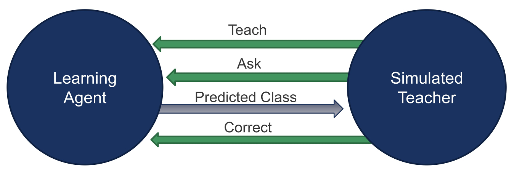

## Open-Ended Learning Approaches for 3D Object Recognition

###### [Hamidreza Kasaei](https://hkasaei.github.io/) | [cognitive robotics course](https://rugcognitiverobotics.github.io/) | [assignment description](https://github.com/SeyedHamidreza/cognitive_robotics_ws/blob/main/first_assignment_cognitive_robotics.pdf)
##


## Assignment overview
Cognitive science revealed that humans learn to recognize object categories ceaselessly over time. This ability allowsthem to adapt to new environments,  by enhancing their knowledge from the accumulation of experiences and theconceptualization of new object categories. Takin. In particular, the agent can interact with the g this theory as an inspiration, we seek to create an interactive objectrecognition system that can learn 3D object categories in an open-ended fashion. In this project, “open-ended” implies thatthe set of categories to be learned is not known in advance. The training instances are extracted from on-line experiencesof a robot, and thus become gradually available over time, rather than being completely available at the beginning of thelearning process.Your  goal  for  this  assignment  is  to  implement  an  open-ended  learning  approach for 3D object recognition. 

We break this assignment down into two parts:
1. The first part is about implementing/optimizing offline 3D object recognition systems, which take an object view as input and produces the category label as output (e.g., apple, mug, fork, etc).

2. The second part of this assignment is dedicated to testing your approach in an open-ended fashion.In this assignment, the number of categories is not pre-defined in advance and the knowledge of agent/robot is increasing over time by interacting with a simulated teacher using three actions: teach, ask, and correct (see Fig.1).

<p align="center">
  
</p>
<p align="center">
  Fig.1 Abstract architecture for interaction between the simulated teacher and the learning agent
</p>

For detailed instructions, please read the [assignment description](https://github.com/SeyedHamidreza/cognitive_robotics_ws/blob/main/first_assignment_cognitive_robotics.pdf).

## Requirements and Installation

You can simply use the provided bash script to install all necessary packages on your machine. Let's see how to do that:


## Clone ROS packages


Clone the repository and compile it:

```sh
mkdir -p ~/cognitive_robotics_ws/src
cd ~/cognitive_robotics_ws/
git clone https://github.com/SeyedHamidreza/cognitive_robotics_ws.git
rm -r src 
mv cognitive_robotics_ws src
mv src/*.sh ~/
```

There should be two bash files, namly setup_all_required_packages.sh and setup_bashrc.sh, in your home folder. 
Then, run the following lines:

```bash
cd ~
sudo chmod +x setup_bashrc.sh
./setup_bashrc.sh
```

Check your bashrc file using: 

```bash
gedit .bashrc

```

The following lines should have been added at the end of your bashrc

```bash
#Add ROS cognitive_robotics_ws as workspace
source /opt/ros/melodic/setup.bash
export LD_LIBRARY_PATH=/opt/ros/melodic/lib:${LD_LIBRARY_PATH:+:${LD_LIBRARY_PATH}}
export ROS_PACKAGE_PATH=$HOME/cognitive_robotics_ws:/opt/ros/melodic/include:${ROS_PACKAGE_PATH}

export ROBOT=sim
export PATH=~/bin:$PATH

export PATH=/usr/lib/python2.7/:$PATH
export LC_NUMERIC="en_US.UTF-8" 

#This line forces the system to use python2 by default since the ROS Melodic still works based on python2
alias python='/usr/bin/python2.7'

```

Afterwards, you need to install all the necessary packages and software, including, ROS melodic, TF, Keras, and leveldb using "setup_all_required_packages.sh" script by running the following lines: 

```bash
cd ~
sudo chmod +x setup_all_required_packages.sh
./setup_all_required_packages.sh
```

To ensure that the installation process was successful, we can check the version of ROS, TF:

```bash
source .bashrc

# use the following line to check ROS version -> the output should be "melodic"
rosversion -d

# use the following line to check Keras and TF -> the output should be "Using TensorFlow backend.  2.3.1"
python -c 'import keras; print(keras.__version__)'

```

## Compile ROS packages


```sh
cd ~/cognitive_robotics_ws/
catkin_make
```

* Notes: 

** Refer to http://wiki.ros.org/catkin/Tutorials/create_a_workspace if you are not familiar with creating a catkin workspace. 
** If you faced with "c++ internal compiler error", use "catkin_make -j 2" instead of "catkin_make". Check the Troubleshooting section for more info.


## Troubleshooting
Here we provide a list of common errors and explain how to fix them. If the problem isn’t clear and you aren’t sure what to do next, contact TAs.


#### 1- dpkg has been locked by other programs

```sh
[ERROR] Could not get lock /var/lib/dpkg/lock’ 
```

This error refers to this point that dpkg has been locked by other programs, you need to wait for a while and try it again


#### 2- c++ internal compiler error

```sh
c++: internal compiler error: Killed (program cc1plus)
```

It usually happens when the system does not have enough resources (RAM/Cores) to compile all packages simultaneously. This can be easily handled by running the "catkin_make -j 2" command in your terminal. This way, ros will only use two cores. In particular, -j n,  specifies the number of jobs (commands) to run simultaneously. Defaults to the environment variable ROS_PARALLEL_JOBS and falls back to the number of CPU cores.


